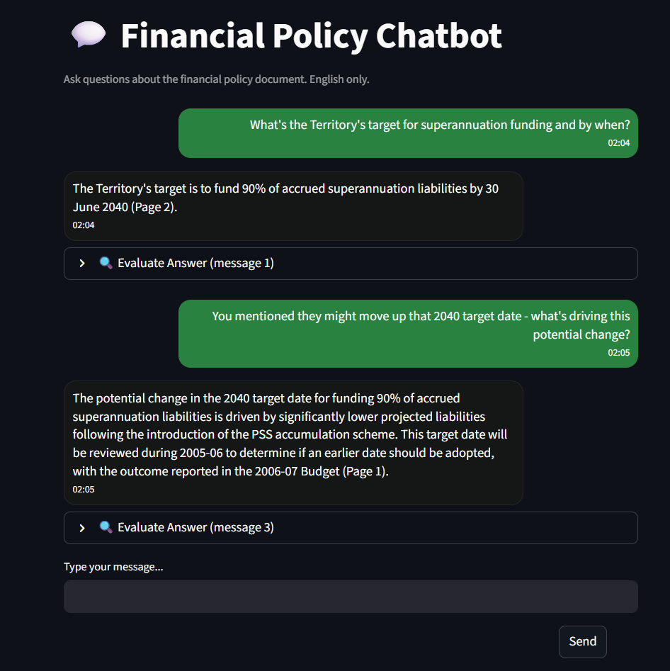
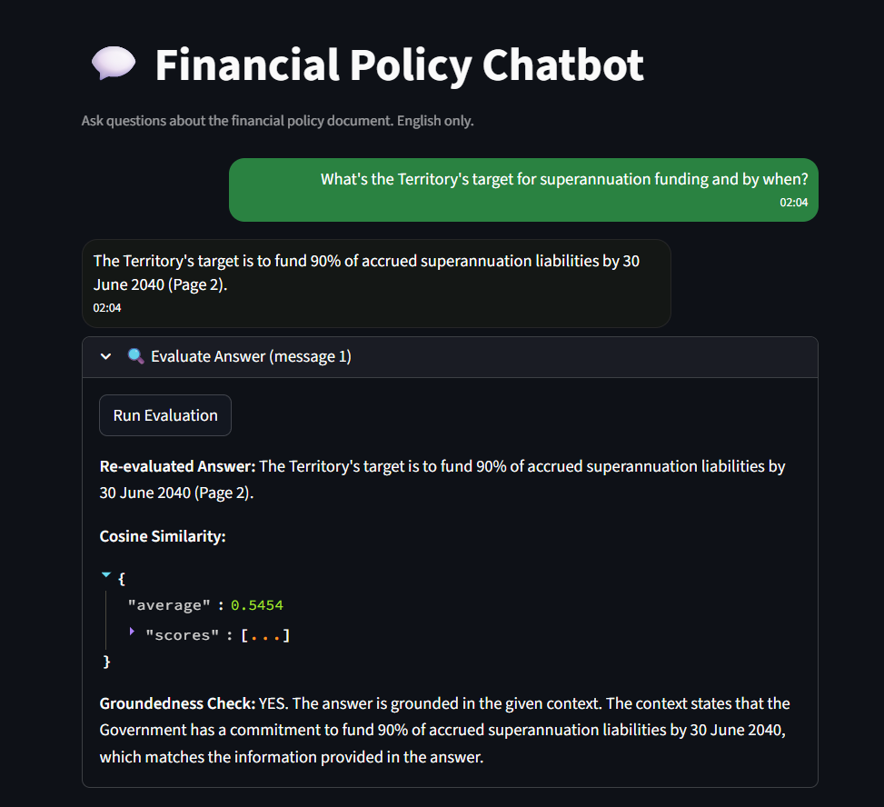

# Financial Policy Chatbot with RAG (Retrieval-Augmented Generation) and Evaluation
This project implements an AI-powered Financial Policy Chatbot that allows users to interact with a financial policy document in natural language. The system is designed using Retrieval-Augmented Generation (RAG), ensuring that all chatbot answers are grounded in the provided PDF document and cited with page references. The system uses Tesseract OCR for English text extraction, OpenAI’s ```text-embedding-3-large``` for multilingual embedding, FAISS for semantic retrieval, and ```GPT-4o``` for context-aware responses. A Streamlit interface communicates with a FastAPI backend for smooth and interactive user experience.

The project is structured into four main components:

1. **PDF Text Extraction (```pdf_extractor.py```)**
    - Uses **PyMuPDF** for native PDF text extraction.
    - Falls back to **Tesseract OCR** when dealing with scanned/low-text pages.
    - Cleans and normalizes extracted text.
    - Saves the processed text in ```data/cleaned_text.txt```.

2. **Vector Index Construction (```build_vector_index.py```)**
    - Splits the cleaned text into manageable chunks (≈500 tokens).
    - Generates embeddings using OpenAI’s ```text-embedding-3-large``` model.
    - Stores embeddings in a **FAISS vector index** (```faiss_index.idx```).
    - Maintains a mapping of valid text chunks (```valid_chunks.pkl```).

3. **Backend API (```app.py```)**
    - Built with **FastAPI**, providing three main endpoints:
      - ```/ask``` → retrieves and answers questions using **RAG**.
      - ```/evaluate``` → evaluates answers with cosine similarity and a **groundedness check**.
      - ```/chat``` → supports multi-turn conversations with **session-based memory**.
    - Uses **GPT-4o** to generate concise, English-only answers with strict instructions:
      - Cite policy document pages (e.g., Page 2).
      - Never invent facts — respond *“Not found in the document”* if answer is unavailable.
    - Conversation memory includes **both user questions and bot answers**, enabling follow-ups like *“What about debt?”*.

4. **Frontend User Interface (```rag_ui.py```)**
    - Built with **Streamlit** for an interactive chat experience.
    - Features a **chat-style UI** with styled user/bot messages and timestamps.
    - Supports **session IDs** so users can have separate conversations.
    - Provides an **“Evaluate Answer”** option under each bot response:
      - Displays the **original user question** and the **AI’s answer**.
      - Runs ```/evaluate``` to show:
         - A re-generated grounded answer.
         - Cosine similarity scores (retrieval accuracy).
         - Groundedness verification (Yes/No with explanation).
           
### Streamlit Chat UI
<p align="center">
  
</p>

### Bot Response Evaluation
<p align="center">
  
</p>


## 📦 Directory Structure
```
├── app.py                  # FastAPI backend (chat, evaluate, ask endpoints)
├── build_vector_index.py   # Embeds and stores vector data using FAISS
├── pdf_extractor.py        # Extracts and preprocesses text from PDF
├── rag_ui.py               # Streamlit chat interface
│
├── index/                  # Vector database storage
│   ├── faiss_index.idx     # FAISS vector index
│   └── valid_chunks.pkl    # Serialized document chunks
│
├── data/                   # Input & processed documents
│   ├── cleaned_text.txt    # Extracted and cleaned text
│   └── For Task - Policy file.pdf    # Example source PDF (policy file)
│
├── .env                    # API keys (ignored in git)
├── .gitignore              # Git ignore file
└── requirements.txt        # Project dependencies
```

## 🚀 Setup Instructions

**Step 1: Clone the Repository and Set Up Environment**
```
git clone https://github.com/md-marop-hossain/Financial-Policy-Chatbot-with-RAG-and-Evaluation.git
cd Financial-Policy-Chatbot-with-RAG-and-Evaluation
python -m venv myenv
source myenv/bin/activate  # or myenv\Scripts\activate on Windows
pip install -r requirements.txt
```
**Step 2: Extract Text from PDF**

Run the following command to extract text from the PDF using ```pdf_extractor.py```:
   
```python pdf_extractor.py```

**Step 3: Build Vector Index**

This step includes chunking, embedding, and creating the vector store:

```python build_vector_index.py```

**Step 4: Launch the FastAPI Server**

Start the FastAPI app using:

```uvicorn app:app --reload```

 **Available API Endpoints:**
   - Ask a question : ```POST http://127.0.0.1:8000/ask```
   - Evaluate an system : ```POST http://127.0.0.1:8000/evaluate```
   - Chat with memory : ```POST http://127.0.0.1:8000/chat```
   
**Step 5: Start the Streamlit UI**

```streamlit run rag_ui.py```

## 🛠️ Tools & Libraries Used

| Category              | Tool/Library           | Purpose                                                                 |
|-----------------------|------------------------|-------------------------------------------------------------------------|
| LLM & Embeddings      | OpenAI GPT-4o          | Generates grounded answers from retrieved context                       |
|                       | text-embedding-3-large | Multilingual, high-quality embeddings for semantic chunk comparison     |
| Vector Store          | FAISS                  | Fast Approximate Nearest Neighbor search over dense vector space        |
| Backend Framework     | FastAPI                | Backend API for handling queries, answers, and evaluations              |
| Frontend Interface    | Streamlit              | Provides a user-friendly web UI for interacting with the RAG system     |
| PDF Text Extraction   | PyMuPDF (fitz)         | Extracts formatted Bangla and English text from PDFs                    |
| OCR (Image PDF)       | pytesseract            | Extracts text from scanned or image-based PDFs using Tesseract OCR      |
| Image Processing      | Pillow (PIL)           | Handles image preprocessing for OCR pipeline                            |
| Evaluation            | scikit-learn           | Computes cosine similarity for answer relevance scoring                 |
| API Key Management    | python-dotenv          | Loads sensitive keys like `OPENAI_API_KEY` securely from `.env` file    |
| Async Handling        | nest_asyncio           | Enables async FastAPI in notebook-style or blocking environments        |
| Tokenization Utility  | tiktoken               | Used to count tokens (e.g., for chunk size management)        |
| Data Serialization    | pickle                 | Loads/stores vector index and text chunks                               |
| Math/Numeric          | numpy                  | Vector and matrix operations                                            |
| Typing & Validation   | pydantic               | Defines and validates API input/output models                           |
| Server                | uvicorn                | ASGI server for running FastAPI app                                     |

## 📑 API Documentation

- Framework: FastAPI

| Endpoint    | Method | Description                                |
|-------------|--------|--------------------------------------------|
| `/`         | GET    | Health check and basic API info            |
| `/ask`      | POST   | Ask a question and get a concise answer with relevant context chunks |
| `/evaluate` | POST   | Get answer with evaluation metrics (cosine similarity, groundedness) |
| `/chat`     | POST   | Multi-turn conversation with session-based memory|

**```/ask``` Example Response:**
```
{
  "answer": "The Territory aims to achieve 90% coverage of accrued superannuation liabilities by June 30, 2040 (Page 2).",
  "context": [
    "..."
  ]
}
```

**```/evaluate``` Example Response:**
```
{
  "answer": "The Territory aims to achieve 90% coverage of accrued superannuation liabilities by June 30, 2040 (Page 2).",
  "cosine_similarity": 0.5454,
  "grounded": true,
  "explanation": "The answer is directly supported by the retrieved context."
}
```

## 📊 Evaluation Matrix

The evaluation matrix helps measure the quality, relevance, and reliability of generated answers by combining:

### 1. **Cosine Similarity Scores**

- Computed between the user query embedding and the embeddings of top retrieved chunks from FAISS.
- Returns:
  - **Average similarity** — mean semantic similarity across retrieved chunks.
  - **Individual scores** — similarity of each chunk against the query.
- Higher scores indicate better semantic alignment between the user query and the retrieved context.
  
### 2. **Groundedness Check**

- Performed using a **GPT-4o evaluation prompt**.
- Ensures that the generated answer is **fully supported** by the retrieved context chunks.
- Returns:
  - **YES** — if the answer is strictly based on context.
  - **NO** — if unsupported or hallucinated, along with a short explanation.

### 3. **Answer Generation**

- Final answers are generated by **GPT-4o** using **retrieved context chunks only**.
- Strict constraints applied:
   - Provide **short, precise answers** (name, number, phrase, or fragment).
   - Always **cite document page(s)** (e.g., Page 4).
   - If answer is not found → respond with *“Not found in the document.”*
- Prevents long, irrelevant, or fabricated responses.

## 🧩 Dependencies

| Package           | Version    | 
|-------------------|------------|
| Python            | 3.8+       | 
| openai            | ≥ 1.3.7     | 
| faiss-cpu         | latest     |
| tiktoken          | latest     |
| pytesseract       | latest     |
| PyMuPDF           | latest     |
| pillow            | latest     |
| fastapi           | latest     |
| uvicorn[standard] | latest     | 
| scikit-learn      | latest     | 
| nest_asyncio      | latest     | 
| streamlit         | latest     | 
| python-dotenv     | latest     | 
| numpy             | latest     |

> 📦 To install all dependencies, run:
```bash
pip install -r requirements.txt
```


